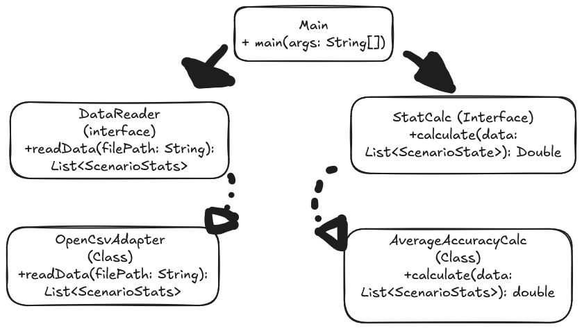

# SE350-App

## Sprint 3

This program is a stat tracker and analyzer for [Kovaaks Aim Trainer](https://store.steampowered.com/app/824270/KovaaKs/). Aim training is an important part for many competitive gamers so knowing your progression over time is important.

In KovaaK's, scenarios are typically 1-minute-long maps (accurately levels) created by the community to practice certain aiming techniques. Aim Trainers are typically played by competitive gamers who strive to increase their aiming within shooter games. Some players also play aim trainers for fun. Scenarios can be made with many differents including different enemy types, user and enemy movement types, speeds, and location, as well and different guns with different shooting speed, different ammo capacities, and reload times.

When fnishing a Kovaaks scenario/map, the game automatically exports static .csv files containing the user's performance data for each RUN the user completes, one scenario exports every single run the user makes so a scenario could have dozens or even hundreds of runs.
The static and automatic files contain a ton of complex data because small nuances most definitely matter at a high level of play. Aim is a crucial skill in competitive gaming, and analyzing performance data helps players identify areas for improvement.

## Some but not all data present in the csv files that may be included in the app

- the date the run of a scenario was completed
- scenario name
- run duration or time remaining if the user dies
- total accuracy within the run
- weapon name, type, and stats such as fire rate, reload time, and ammo capacity
- sensitivity and DPI (dots per inch) in settings of the player
= average FPS (frames per second) of the run and max FPS set in config
- screen resolution, resolution scale, and FOV (field of view),
- crosshair name, color, and scale
- game version
- distance traveled, fight time, deaths, and overshots
- scenario user pause count and duration

## App UML diagram

 

To ensure you are able to run the project independently without the game, the repo contains a prepopulated directory with my actual .csv log files. The src directory will have a script that compiles the application, launches the GUI, and runs the tracker against the included data.

### Final Submission Goal

For the final submission, this application will read a directory of local example KovaaK's CSV files. It will use calculations to aggregate the player's performance data (such as average accuracy, total playtime, high scores, and improvement overtime), and display these metrics in a JavaFX Graphical User Interface (GUI). This will allow the user to visually track their aim improvement over time.

### Sprint 3 Issues & Resolutions

- **Git Configuration:** Some commits were accidentally made under the username `BamhamYT` instead of my primary account `hammyo-o`. I am working solo as a one-person group, and both accounts belong to me.

- **Java Version Mismatch:** I got an `UnsupportedClassVersionError` when trying to execute the program via the CLI because it defaulted to an older Java 8 JRE instead of the Java 25 JDK used to compile the code. I resolved this by updating system environment variables and running through Maven (`mvn clean compile` and `mvn exec:java`).
- **Data Parsing Complexity:** KovaaK's CSV exports are not uniform tables; they contain a mixed format of individual kill logs followed by summary statistics. This broke OpenCSV's automated `@CsvBindByName` mapping. I resolved this by no longer using the bean builder and using a raw `CSVReader` to parse the file line-by-line.

### Planned Libraries

- **GUI:** JavaFX. Not implemented yet.
- **OpenCSV:** For parsing local CSV export data from the game.
- **JUnit:** For unit testing metric calculations.

### How to Run

This project uses Maven for dependency management and execution. Do not compile manually.

To clean, compile, and run the application, execute the following commands in the root directory:

```bash
mvn clean compile
mvn exec:java "-Dexec.mainClass=Main"
